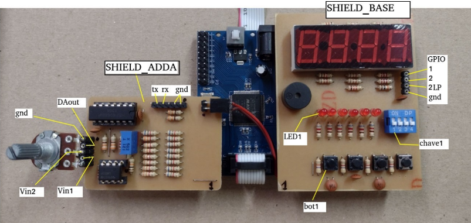

# Projetos de Sistemas Digitais (VHDL)

Repositório criado para documentar os projetos desenvolvidos na disciplina de Projetos de Sistemas no IFES, com foco no estudo 
e aplicação da linguagem VHDL.

## Placa de Desenvolvimento

O desenvolvimento dos projetos utiliza a PLACA EPM240T100C5N com gravador USB Blaster.

[Link de compra](https://pt.aliexpress.com/item/1005004872591240.html)

## Shields Auxiliares

1. Placa EPM240T100C5N:

| Componente  | Descrição        | Pinos  |
|-------------|------------------|--------|
|  Onboard    | Clock  50MHz     |  12    |
|             | LED              |  77    |

2. SHIELD_BASE

| Componente  | Descrição        | Pinos  |
|-------------|------------------|--------|
| Chaves      | Chave 1          | `75`   |
|             | Chave 2          | `76`   |
|             | Chave 3          | `74`   |
|             | Chave 4          | `72`   |
| Botões      | Botão 1          | `55`   |
|             | Botão 2          | `56`   |
|             | Botão 3          | `58`   |
|             | Botão 4          | `66`   |
| LEDs        | LED 1            | 69     |
|             | LED 2            | 71     |
|             | LED 3            | 73     |
|             | LED 4            | 67     |
|             | LED 5            | 61     |
|             | LED 6            | 57     |
| GPIO        | GPIO 1           | 61     |
|             | GPIO 1           | 57     |
|             | GPIO 1           | 89     |
| Buzzer      | Buzzer 1         | 84, 86 |
| Display     | Cátodo (milhar)  | 97     |
|             | Cátodo (centena) | 95     |
|             | Cátodo (dezena)  | 91     |
|             | Cátodo (unidade) | 85     |
|             | Segmento (a)     | 99     |
|             | Segmento (b)     | 98     |
|             | Segmento (c)     | 78     |
|             | Segmento (d)     | 81     |
|             | Segmento (e)     | 83     |
|             | Segmento (f)     | 100    |
|             | Segmento (g)     | 77     |
|             | Segmento (.)     | 82     |

3. SHIELD_ADDA

| Componente            | Descrição                       | Pinos                           |
|-----------------------|---------------------------------|---------------------------------|
| Alimentação           | 3.3V                            | 51                              |
| Conversor DA (TryVal) | Bus (7 downto 0)                | 52, 50, 48, 44, 42, 40, 38, 36  |
| Comparador de Tensão  | Saída (Vcomp_out)               | `53`                            |
| Entrada Analógica     | Selecionar Vin1                 | 30                              |
|                       | Selecionar Vin2 (potenciômetro) | 34                              |
| Comunicação Serial    | UART TX                         | 35                              |
|                       | UART RX                         | 33                              |

## Observações Importantes
1. Para os pinos `marcados`, deve-se ativar o pull-up e configurar como Schmitt Trigger.
2. O pino 2LP é o pino 2 conectado a um filtro passa-baixa com constante de tempo de 1 ms.